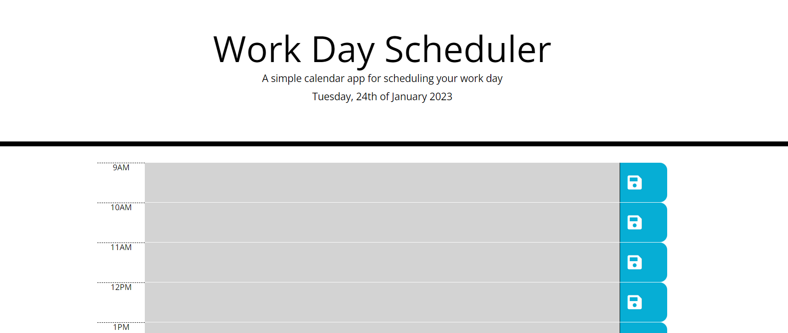

# Work-day-scheduler

## Description

A basic work agenda for the day showing incoming and past tasks.

## Installation

No software instalation is needed. The deployed application is online and can be used from most of internet browsers.

## Usage

Press over any time slot and add your text. Save to local storage at the righ button.

Screenshot:

## Link to a live example

https://turquele.github.io/Work-day-scheduler/

## Link to the repository

https://github.com/turquele/Work-day-scheduler

## Credits

N/A

## License

MIT